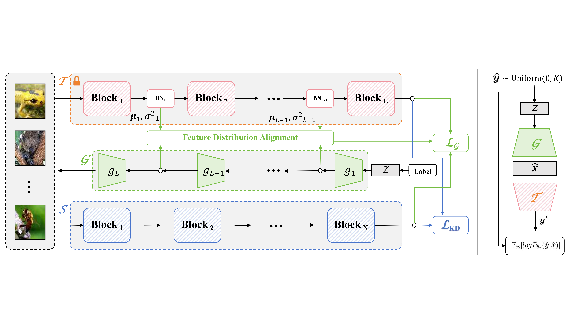

## The source code for "Coupling the Generator with Teacher for Effective Data-Free Knowledge Distillation" accepted by ICCV 2025.

## Motivation

Data-Free Knowledge Distillation (DFKD) avoids accessing the original training data during knowledge transferring from a large model to a smaller one, possessing significant potential in ensuring the widespread promotion of industry-level applications while safeguarding user privacy and data security. Unfortunately, due to the lack of precise estimation of the original data distribution, existing DFKD methods often rely on manually induced priors to constrain the generator to produce samples that comply with the rules as much as possible. In this paper, we propose a novel method dubbed \textbf{C}ou\textbf{P}ling \textbf{Net}work (\textbf{CPNet}) that constructs a generator to explicitly approximate the inverse transformation of the teacher model. Consequently, the two components can be integrated into an autoencoder specifically tailored for label information, where the generated images are treated as latent variables. Since real labels are typically uniformly distributed and the parameters of the teacher model are fixed, this enables our generator to produce images that closely approximate the true distribution. Besides, we transform real labels into feature-level constraints through the inverse transformation of a network classifier with fixed parameters, thereby converting the classification problem of generated images into an issue of distance measurement between features. We utilize this constraint for adversarial training and enhancing the diversity of produced images. Extensive experiments on three public benchmarks demonstrate that our proposed method achieves superior or competitive performance compared to previous state-of-the-art methods, while also exhibiting faster generation speed.

## Method



## Quick Start

We use the pre-trained teacher models from [NAYER's repo](https://www.dropbox.com/sh/w8xehuk7debnka3/AABhoazFReE_5mMeyvb4iUWoa?dl=0) and put them in `checkpoints\pretrained', or you can train them from scratch as follows:

```bash
python train_scratch.py --model wrn40_2 --dataset cifar10 --batch-size 256 --lr 0.1 --epoch 200 --gpu 0
```
   
### 2. Reproduce our results
See [cpnet_100.sh](cpnet_100.sh) and [cpnet_300.sh](cpnet_300.sh) for commands to run data-free knowledge distillation with our CPNet, a sample is shown below.

    ```bash
    nohup python datafree_kd.py --batch_size 512 --synthesis_batch_size 400 --lr 0.2 --gpu 0 --warmup 20 --epochs 120 \
    --dataset cifar100 --method cpnet --lr_g 4e-3 --teacher resnet34 --student resnet18 --save_dir run/c100r34r18-cpnet \
    --adv 1.33 --bn 10.0 --oh 0.5 --dist 0.0 --g_steps 40 --g_life 10 --g_loops 2 --gwp_loops 10 \
    --log_tag c100r34r18-cpnet-ep120 > logs/final/c100r34r18-cpnet-ep120.log 2>&1 &
    ```

### Acknowledgement

Ours code is based on [NAYER](https://github.com/tmtuan1307/NAYER) and [Fast](https://github.com/zju-vipa/Fast-Datafree), thanks for their nice work!
